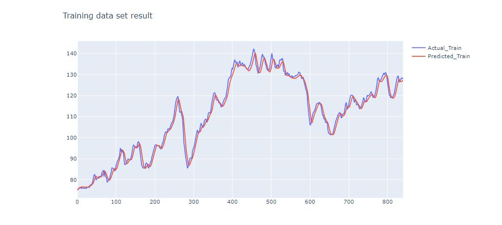
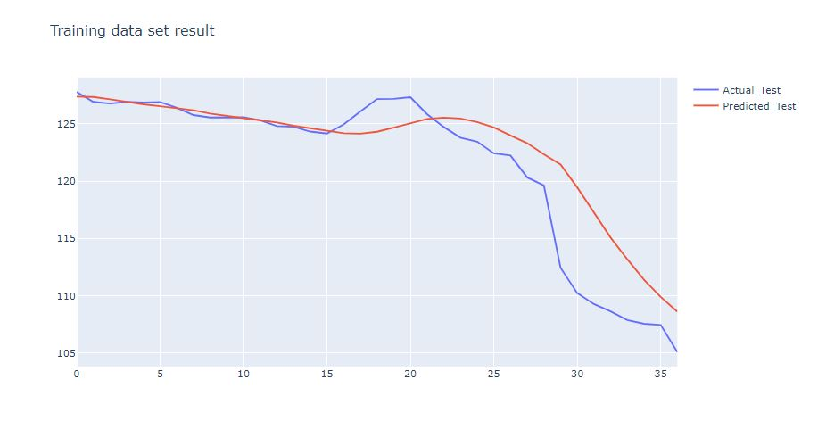
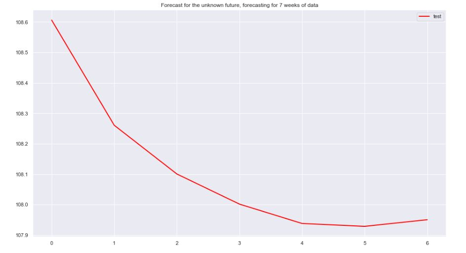
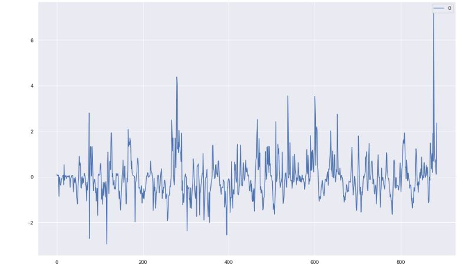
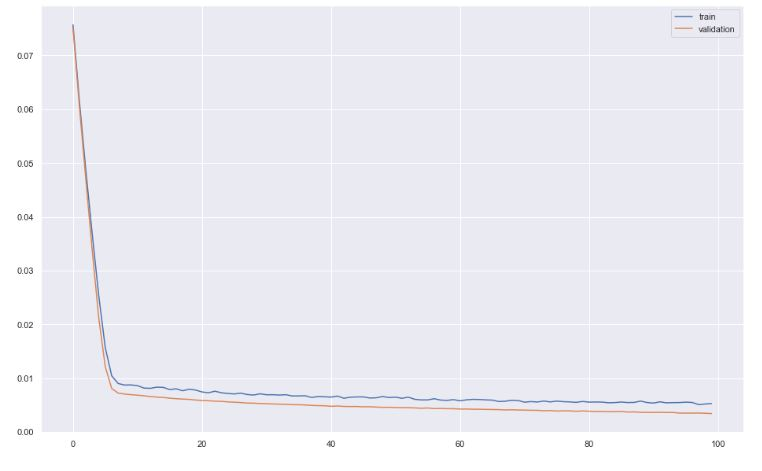
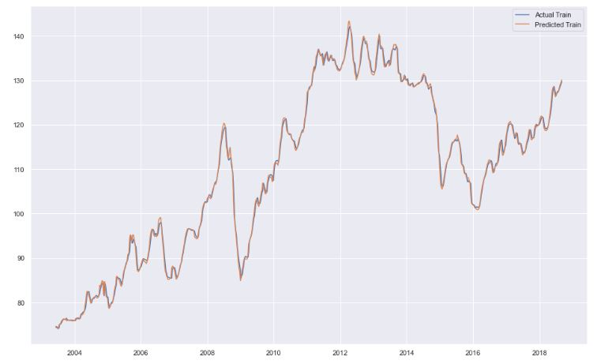
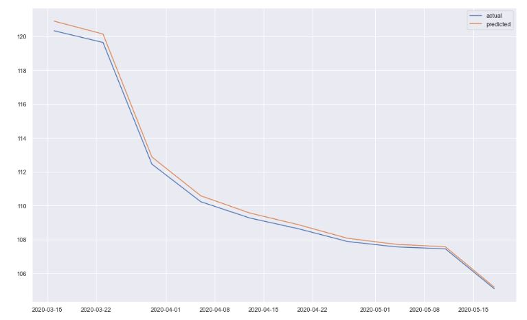
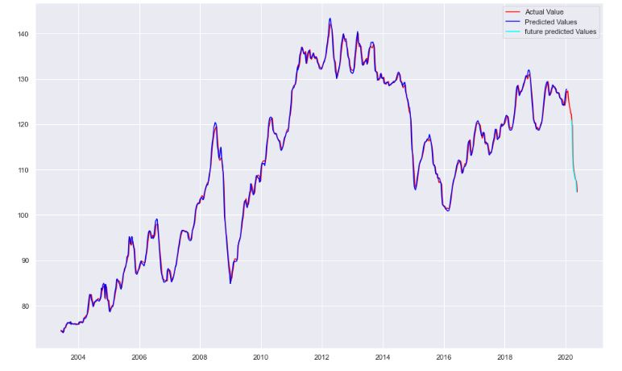

### 1) EDA and Forecasting on weekly petrol and diesel data in the UK

**Jupyternotebook links:**
- <a href="https://nbviewer.jupyter.org/github/NyanoNyan/Portfolio/blob/59639bfcaf796363e91acf44e9b83818aa347953/1)%20EDA%20and%20Forecasting/Clean_EDA_weekly_road_fuel.ipynb">Exploratory Data Analysis (EDA) on weekly petrol and diesel data </a>

- <a href="https://nbviewer.jupyter.org/github/NyanoNyan/Portfolio/blob/8f090e46031668a77bcf0d93c0fad397fccafe0d/1)%20EDA%20and%20Forecasting/Clean_LSTM_Forecasting_weekly_road_fuel_without_trend.ipynb">LSTM forecasting **without Trend removal**</a>

- <a href="https://nbviewer.jupyter.org/github/NyanoNyan/Portfolio/blob/22201b5ecb361169cb0288bfdd76b4190e810b4e/1)%20EDA%20and%20Forecasting/Clean_LSTM_Forecasting_weekly_road_fuel.ipynb">LSTM forecasting **with Trend removal**</a>

**Details about the data:**

- This data is from June 2003 till May 2020. When the data was extracted, the latest data was from May 2020.

- The data was for a weekly road fuel prices on the cost for the unleaded petrol (ULSP) and unleaded diesel (ULSD).

- Univariate forecasting method was used

- A 7 day windowed data size was chosen due to the data being weekly. Also, a weekly data would seem appropriate to choose to forecast future weeks.

- A bidrectional LSTM was used form this model. L2 and dropout regularization were used to reduce overfitting.

### Forecasting without trend removal

- For this section, I looked took the petrol pump price data over time and used bi-directional LSTM model to fit and predict future values of weekly petrol data in the UK.

- In this section, I did not implement de-trending to view how the results would fair compared to de-treding the data.
A univariate approach was used for this, as when additional features such as petrol_duty_rate, petrol_vat_percent_rate, and Year were added, it did not improve the model. However, this model, can be adapted to a multivariate time series, by feeding it x columns data and changing the num_x to numbers of features.

- Furthermore, 90% (841 values) of the data was used for training and 5% (37 values) was used for testing.

- In the end, predicted 7 weeks of data for the petrol prices into the future with the model.

**Training and testing loss:**

- Results on the training and validation are good as validation loss is lower compared to the training loss. This helps as the model will be able to predict future values better.

Train MSE: 5.102

Test MSE: 10.504

- Results on training set shows that the predicted values are similar to the actual values.

- Although, not perfect. The results from the predicted values from the test/validation data shows that it is able to predict similar trend compared to the actual test.

**Predicting the future:**

7 weeks into the future shows there is going to be a downwards trend in the petrol price in the following weeks.

### Forecasting with trend removal

- For this section, I looked took the petrol pump price data over time and used bi-directional LSTM model to fit and predict future values of weekly petrol data in the UK.

- I also applied detrending before fitting the model as in papers it was a recommended step for pre-processing. Also, due to detrending, this will make the data staionary which will allow the model to train well.

- A univariate approach was used for this, as when additional features such as petrol_duty_rate, petrol_vat_percent_rate, and Year were added, it did not improve the model. However, this model, can be adapted to a multivariate time series, by feeding it x columns data and changing the num_x to numbers of features.

- The cross-validtion for this data set was changed a little bit. 90% (841 values) of the data was used for training and 8% (71 values) was used for testing. Lastly, 2% of the data (11 values) were used to test unknown future values.

**Training and testing loss:**

- Results on training set shows that the predicted values are similar to the actual values.

- Information

- Future predictions

